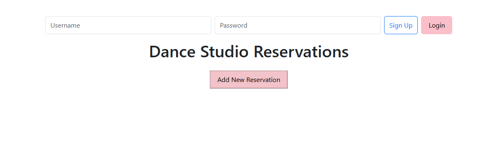
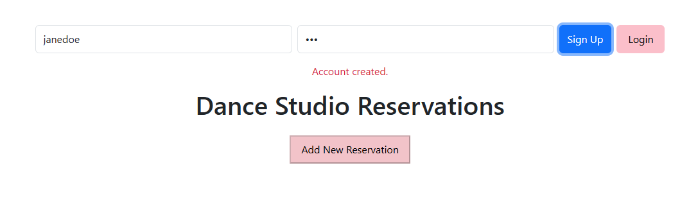
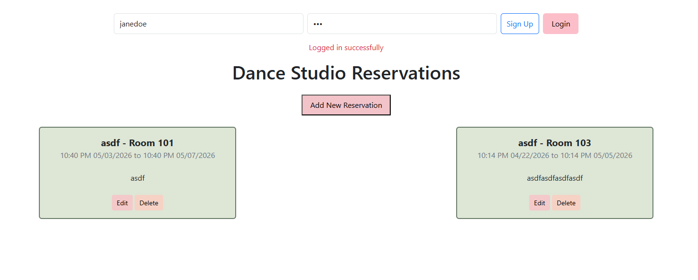
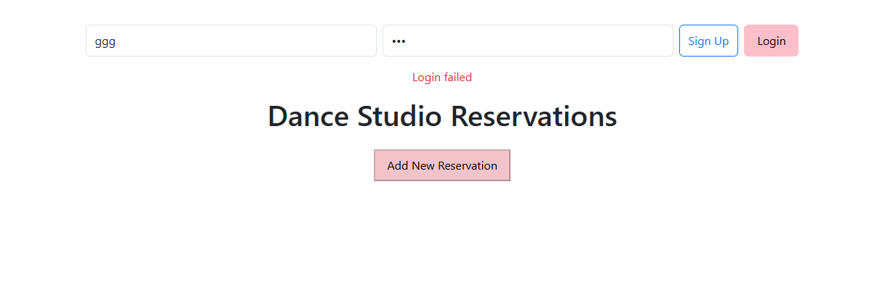

# Assignment 4: User Login

This assignment takes my previous mid-term project (Dance Studio Reservations) and integrates it with MongoDB, making my app use a real database instead of using in-memory objects. Along with this, my app will also include a user login at the top, using features such as authentication using JWT and password hashing. Once a user signs up and logs in, the overall app works the same, with users being able to create, read, update, and delete reservations. No reservations should be visible until a user logs in.

Screenshots of the new login features are also included in the repository.

---

## Tech Stack

Some new things introduced to the backend include:
- MongoDB
- Beanie (ODM) and motor
- JWT Authentication
- bcrypt (password hashing)

---

## Project Structure
```

├── auth/
│ ├── hash_password.py → Python file that handles password hashing and verification using bcrypt
│ ├── jwt_handler.py → Creates and decodes JWT tokens for user authentication
│ └── authenticate.py → Verifies JWT tokens for protected routes (/Reservations)
│
├── models/
│ ├── user.py → Defines and validates the User database model (username, hashed password)
│ └── reservation.py → Defines and validates the Reservation and ReservationRequest models
│
├── frontend/
│ ├── favicon.ico → Favicon of a woman dancing
│ ├── index.html → Main HTML page for the web interface and structure
│ ├── main.js → JavaScript file for frontend interactions and API calls
│ └── style.css → CSS file for styling the page and buttons
│
├── screenshots/
│ ├── account_creation.png → Screenshot of user sign-up process
│ ├── login.png → Screenshot of successful login and authenticated homepage
│ ├── login_fail.png → Screenshot of login error when credentials are incorrect or missing
│ └── signup_login_homepage.png → Screenshot of homepage when the app is first loaded
│
├── auth_routes.py → API routes for user signup and login with JWT authentication
├── reservation_routes.py → CRUD API routes for managing reservations (requires authentication)
├── reservation_db.py → MongoDB connection setup and initialization using Beanie and Motor
├── main.py → FastAPI application entry point
├── requirements.txt → Python dependencies
└── README.md → Project documentation
```

## Authentication Flow

1. User signs up (`/auth/signup`)
2. User logs in (`/auth/sign-in`)
3. Server returns JWT token
4. Token is stored in `sessionStorage`
5. All protected routes require:

```
Authorization: Bearer <token>
```

---

## API Endpoints

### Auth
| Method | Endpoint          | Description       |
|--------|------------------|------------------|
| POST   | `/auth/signup`   | Create user      |
| POST   | `/auth/sign-in`  | Login user       |

### Reservations*
| Method | Endpoint              | Description              |
|--------|----------------------|--------------------------|
| GET    | `/Reservations`      | Get all reservations     |
| POST   | `/Reservations`      | Create reservation       |
| PUT    | `/Reservations/{id}` | Update reservation       |
| DELETE | `/Reservations/{id}` | Delete reservation       |

> *All reservation routes require authentication.

---

## Screenshots

`signup_login_homepage.png` - Below is a screenshot of the initial homepage before user signs up and logs in. The `Add New Reservation` button is borderless, and is unable to be clicked on before user logs in.



`account_creation.png` - After username and password is successfully created, a message is shown informing users that their account is set up.



`login.png` - A messagge is shown for a successful user login. Once user is logged in, the `Add New Reservation` button is now working/available, and users are able to see, create, edit, and delete reservations, similar to the original mid-term project.



`login_fail.png` - An error message is shown when login is unsuccessful. `Add New Reservation` is still not available, and reservations are not visible. 



---
